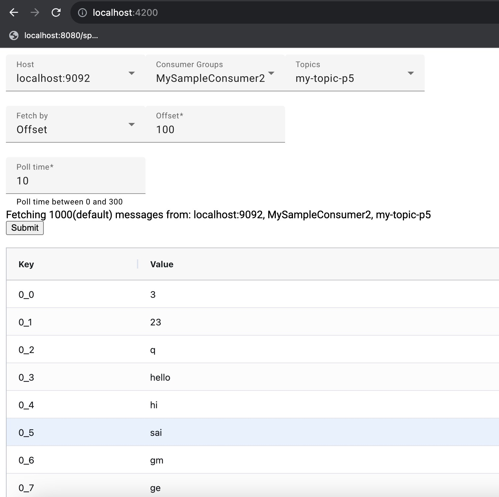
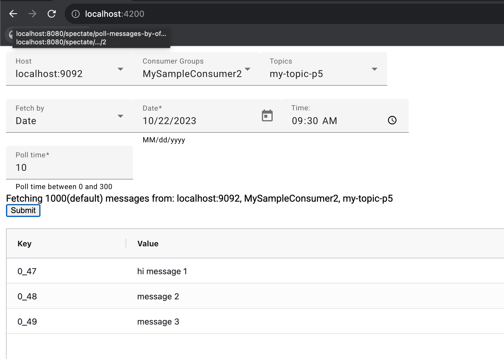

# Kafka Message Spectator UI

This UI is connected to <a href="https://github.com/kotari4u/kafka-message-spectator/blob/phase-1/kafka-message-spectate-boot/README.md">Kafka Message spectator boot</a>
and display messages polled by API. It uses angular grid to display messages in a grid format. Angular Material is being used for drop downs, date time
 
This project was generated with [Angular CLI](https://github.com/angular/angular-cli) version 16.2.1.

## Installation
sudo npm install --save ag-grid-community
sudo npm install --save ag-grid-angular

// Angular material to show drop downs and date time components
sudo ng add @angular/material
  -  theme custom or any choice that angular material listed out
  -  Typography Not needed
  -  Enable animations

sudo npm install --save  @angular-material-components/datetime-picker

## Poll message by Offset

## Poll message by Date

## Development server

Run `ng serve` for a dev server. Navigate to `http://localhost:4200/`. The application will automatically reload if you change any of the source files.

## Code scaffolding

Run `ng generate component component-name` to generate a new component. You can also use `ng generate directive|pipe|service|class|guard|interface|enum|module`.

## Build

Run `ng build` to build the project. The build artifacts will be stored in the `dist/` directory.

## Running unit tests

Run `ng test` to execute the unit tests via [Karma](https://karma-runner.github.io).

## Running end-to-end tests

Run `ng e2e` to execute the end-to-end tests via a platform of your choice. To use this command, you need to first add a package that implements end-to-end testing capabilities.

## Further help

To get more help on the Angular CLI use `ng help` or go check out the [Angular CLI Overview and Command Reference](https://angular.io/cli) page.
